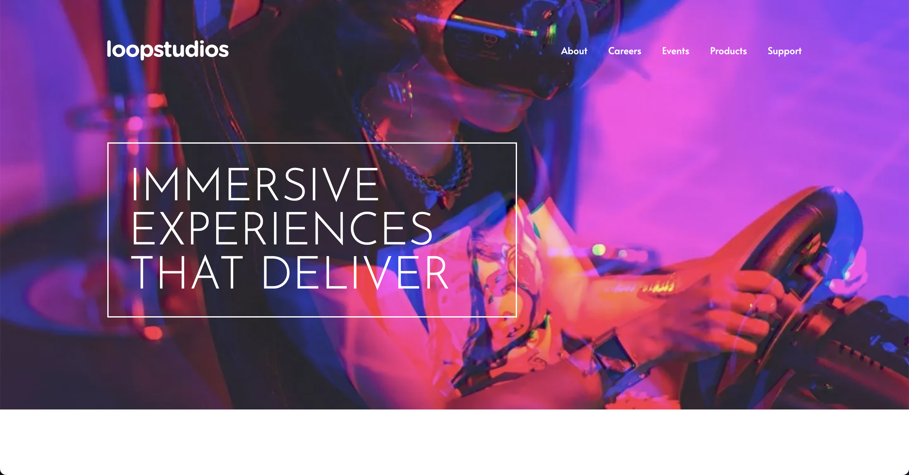
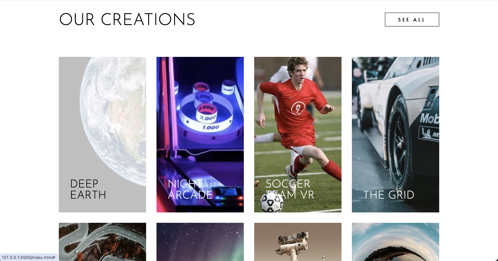
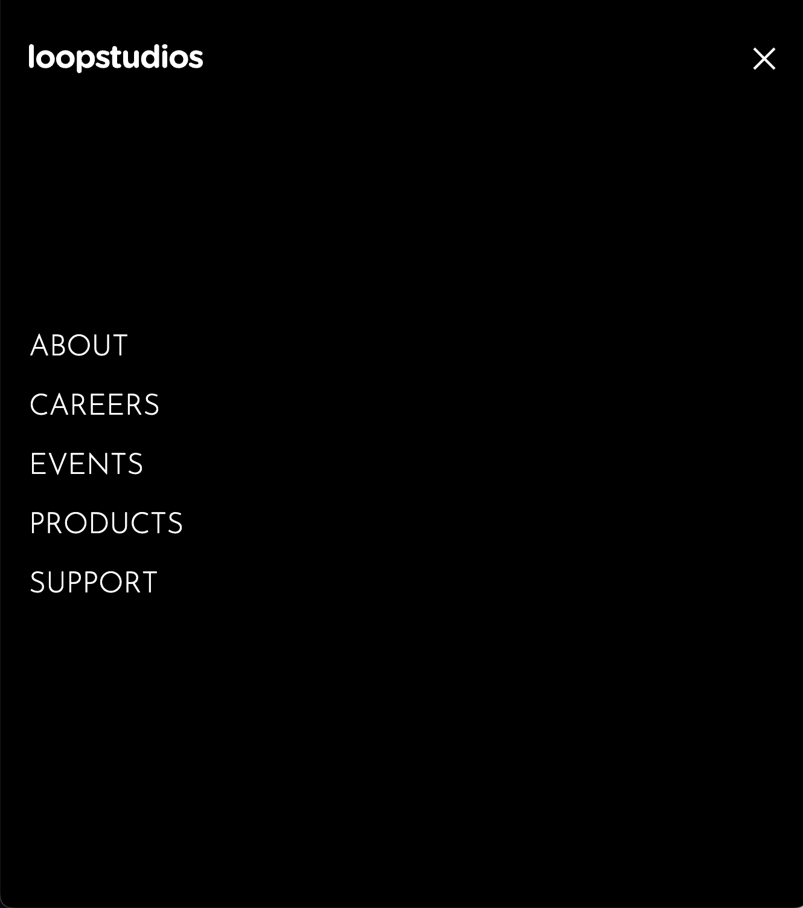

# Frontend Mentor - Loopstudios landing page solution

This is a solution to the [Loopstudios landing page challenge on Frontend Mentor](https://www.frontendmentor.io/challenges/loopstudios-landing-page-N88J5Onjw). Frontend Mentor challenges help you improve your coding skills by building realistic projects.

## Table of contents

- [Overview](#overview)
  - [The challenge](#the-challenge)
  - [Screenshot](#screenshot)
  - [Built with](#built-with)
- [Author](#author)
- [Acknowledgments](#acknowledgments)

## Overview

Responsive and 100% lighthouse Accessible layout with the optimized fonts and images.

### The challenge

Users should be able to:

- View the optimal layout for the site depending on their device's screen size
- See hover states for all interactive elements on the page

### Screenshot

### Links

- Solution URL: [https://github.com/NikitaVologdin/Loopstudios-landing-page](https://github.com/NikitaVologdin/Loopstudios-landing-page)
- Live Site URL: [https://loopstudios-landing-page-weld-theta.vercel.app/](https://loopstudios-landing-page-weld-theta.vercel.app/)

### Built with

- Semantic HTML5 markup
- Accessibility
- CSS custom properties
- Flexbox
- CSS Grid
- Mobile-first workflow
- Sass
- Bem

## Author

- Website - [Nikita Vologdin](https://vologdin.eu/portfolio)
- Frontend Mentor - [@NikitaVologdin](https://www.frontendmentor.io/profile/NikitaVologdin)
